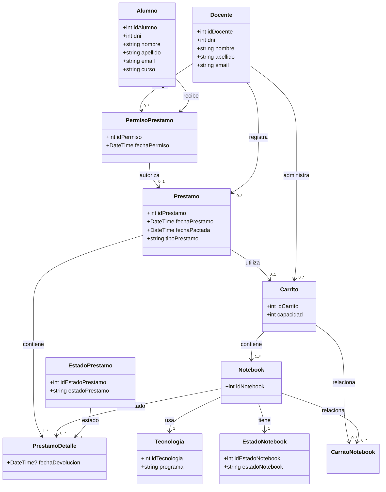

```mermaid

classDiagram

class Docente {
  +int idDocente
  +int dni
  +string nombre
  +string apellido
  +string email
}

class Alumno {
  +int idAlumno
  +int dni
  +string nombre
  +string apellido
  +string email
  +string curso
}

class PermisoPrestamo {
  +int idPermiso
  +DateTime fechaPermiso
}

class Prestamo {
  +int idPrestamo
  +DateTime fechaPrestamo
  +DateTime fechaPactada
  +string tipoPrestamo
}

class PrestamoDetalle {
  +DateTime? fechaDevolucion
}

class Notebook {
  +int idNotebook
}

class Tecnologia {
  +int idTecnologia
  +string programa
}

class EstadoNotebook {
  +int idEstadoNotebook
  +string estadoNotebook
}

class Carrito {
  +int idCarrito
  +int capacidad
}

class EstadoPrestamo {
  +int idEstadoPrestamo
  +string estadoPrestamo
}

%% ==== RELACIONES ENTRE CLASES ====

Docente --> "0..*" PermisoPrestamo : otorga
Alumno --> "0..*" PermisoPrestamo : recibe
PermisoPrestamo --> "0..1" Prestamo : autoriza

Docente --> "0..*" Prestamo : registra
Prestamo --> "0..1" Carrito : utiliza

Prestamo --> "1..*" PrestamoDetalle : contiene
Notebook --> "0..*" PrestamoDetalle : esPrestado

EstadoPrestamo --> "1" PrestamoDetalle : estado

Notebook --> "1" Tecnologia : usa
Notebook --> "1" EstadoNotebook : tiene

Docente --> "0..*" Carrito : administra
Carrito --> "1..*" Notebook : contiene

Carrito --> "0..*" CarritoNotebook : relaciona
Notebook --> "0..*" CarritoNotebook : relaciona

```