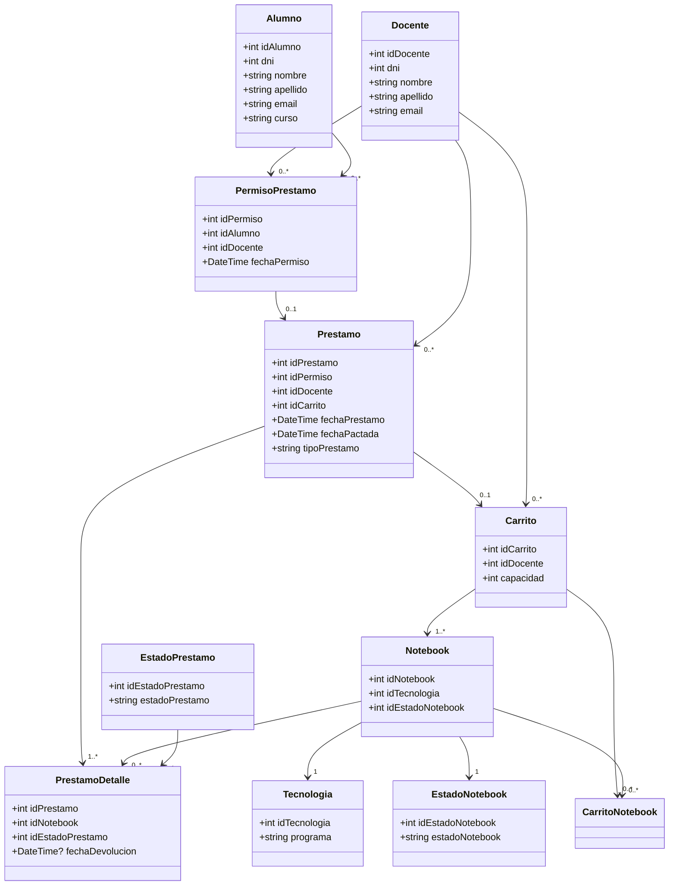

```mermaid

classDiagram

class Docente {
  +int idDocente
  +int dni
  +string nombre
  +string apellido
  +string email
}

class Alumno {
  +int idAlumno
  +int dni
  +string nombre
  +string apellido
  +string email
  +string curso
}

class PermisoPrestamo {
  +int idPermiso
  +int idAlumno
  +int idDocente
  +DateTime fechaPermiso
}

class Prestamo {
  +int idPrestamo
  +int idPermiso
  +int idDocente
  +int idCarrito
  +DateTime fechaPrestamo
  +DateTime fechaPactada
  +string tipoPrestamo
}

class PrestamoDetalle {
  +int idPrestamo
  +int idNotebook
  +int idEstadoPrestamo
  +DateTime? fechaDevolucion
}

class Notebook {
  +int idNotebook
  +int idTecnologia
  +int idEstadoNotebook
}

class Tecnologia {
  +int idTecnologia
  +string programa
}

class EstadoNotebook {
  +int idEstadoNotebook
  +string estadoNotebook
}

class Carrito {
  +int idCarrito
  +int idDocente
  +int capacidad
}

class EstadoPrestamo {
  +int idEstadoPrestamo
  +string estadoPrestamo
}

Docente --> "0..*" PermisoPrestamo
Alumno --> "0..*" PermisoPrestamo 
PermisoPrestamo --> "0..1" Prestamo 

Docente --> "0..*" Prestamo 
Prestamo --> "0..1" Carrito 

Prestamo --> "1..*" PrestamoDetalle 
Notebook --> "0..*" PrestamoDetalle 

EstadoPrestamo --> "1" PrestamoDetalle

Notebook --> "1" Tecnologia 
Notebook --> "1" EstadoNotebook 

Docente --> "0..*" Carrito 
Carrito --> "1..*" Notebook 

Carrito --> "0..*" CarritoNotebook 
Notebook --> "0..*" CarritoNotebook 

```